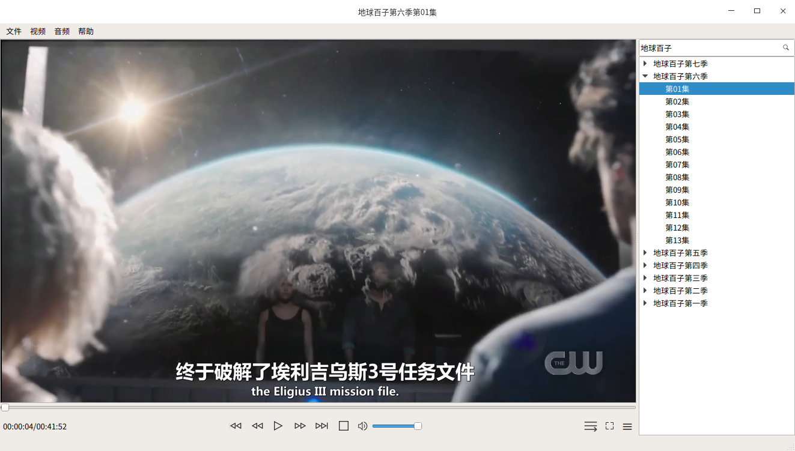
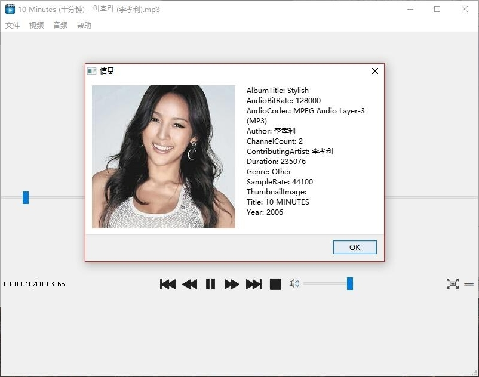

# Qt 海天鹰媒体播放器
Linux 平台基于 Qt 的 QMultiMedia 的媒体播放程序，支持某些直播。  
已编译好的 HTYMP 程序适用64位 Linux 系统 Qt5 环境，双击运行，终端运行 ./install.sh 生成desktop。  
### 依赖  
sudo apt-get install libqt5multimedia5 libqt5multimediawidgets5

  

### 2.0 视频旋转镜像
[参考](https://github.com/mgardner99/490/blob/master/mainwindow.cpp)
### 1.7 增加对直播API的解析，换鼠标拖动代码更平滑，增加历史记录，增加接收Chrome扩展传来的直播网址。
### 1.6版 增加解析分号分隔的网络媒体字符串到播放列表，遍历媒体信息，增加读取音频封面图片(Windows有效，Linux无效，Mac没试)。
  
### 1.5版 增加显示错误信息，增加拖放打开文件。
### 1.4版 解决有视频无声音的问题。
### 1.3版 直播列表做到窗体里面，支持显隐，记忆显隐，根据媒体信息设置视频大小。
### 1.2版 增加截图和剧情连拍。
  

### 1.1版 增加直播列表。

### 错误排除
* 没有权限 ：  
程序右键属性，勾选“允许以程序执行”。  
  
* 深度文件管理器直接运行程序无法载入直播列表：  
方法1：从终端启动。  
方法2：修改desktop文件中的路径，从desktop文件启动。  
  
* Project ERROR: Unknown module(s) in QT: multimedia  
sudo apt-get install qtmultimedia5-dev  

* 快捷键失效：  
鼠标移动到窗口非视频区域激活，全屏下鼠标移动到进度条上激活。

### 找不到‘video/mpegts, systemstream=(boolean)true, packetsize=(int)188’类型可用的解码器

### 有声音无视频:  
#### Linux
* 报 va 相关错误  
参考：https://bugreports.qt.io/browse/QTBUG-23761  
解决：sudo apt-get remove gstreamer1.0-vaapi  
感谢：liujianfeng@deepin.org
* 不报错  
    sudo apt-get install gst123  
    下列【新】软件包将被安装：  
    gst123 gstreamer1.0-pulseaudio gstreamer1.0-x  

#### Windows
* 安装 LAV Filters 解码解决。